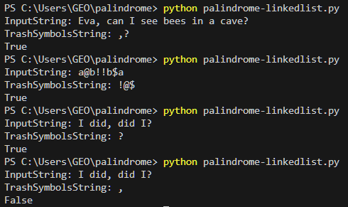

# Palindrome  
  
## Requirement:  
A palindrome is a word, number, phrase, or other sequence of characters which reads the same backward as forward, 
such as madam or racecar or the number 10201.  
  
Consider there are 2 strings. InputString and a TrashSymbolString. Please implement the method to check if the InputString is palindrome, if all trash symbols are ignored. Symbol case should be ignored.  
  
During the implementation TrashSymbols are not removed from the InputString and no new strings are created.  
  
**InputString is scanned only once  
  

## HOW TO:  

  

Example:  
InputString: a@b!!b$a  
TrashSymbolsString: !@$  
Expected output: true  
  
InputString: ?Aa#c  
TrashSymbolsString: #?  
Result should be: false  
  
InputString: Eva, can I see bees in a cave?  
TrashSymbolsString: #?  
Result should be: false